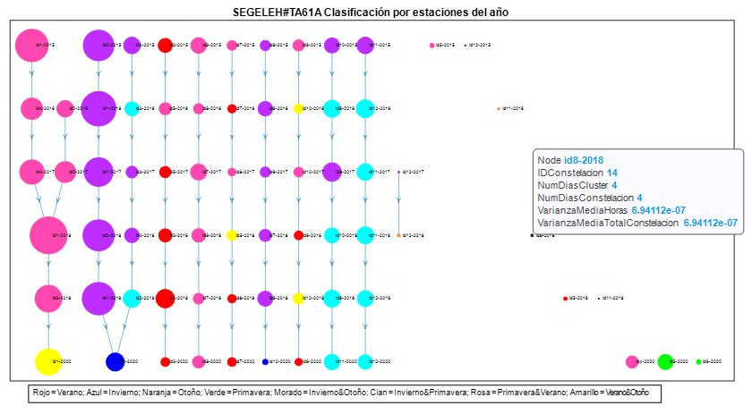
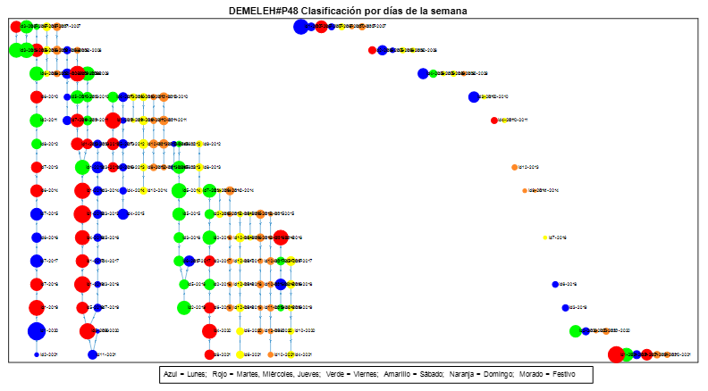

# Time Evolution Analysis of Electricity Daily Load Profiles in Spain

## Abstract

This project studies the time evolution of different electricity demand rate profiles in Spain.  
An interpretable model has been created in order to show the changes and patterns present in the consumption of electricity. Moreover, it has been identified that calendar, climatological, and socio-economic factors greatly affect the behavior displayed.

**Keywords:** K-means, Matlab, load profiles, graph

---

## 1. Introduction

Several projects have focused on the study of electricity profiles from a specific
electricity rate, such as domestic consumption or industrial consumption. Most
previous projects handle data from a specific year. However, this study handles data
covering a much longer period of time (2007 to 2021). Thus, the goal of this project is
to be able to model the time evolution of electricity daily profiles of different electricity
rates in Spain.

An exploratory analysis has been conducted for each electricity rate studied, which has
identified the existence of groups within the electricity consumption rates. With the use
of machine learning techniques profiles with common characteristics have been grouped
together and annual typical profiles have been obtained. Also, these annual typical
profiles have been analyzed and its time evolution has been modelled.

Additionally, for each typical profile it has been identified which variables are related to
them and its time evolution has been studied. The behavior presented by these typical
profiles has been also related with climatological and social economic variables.

All electricity daily load data has been obtained from **REE (E-SIOS)**. This project has
been accomplished with the help of the Matlab tool.

---

## 2. Definition of the Project

In order to model the time evolution of electricity daily profiles of different electricity rates, a series of objectives have been achieved:

- Corrections due to time change effects have been applied to the electricity load data.
- Load profiles have been normalized to facilitate analysis.
- A preliminary analysis classifying profiles by calendar variables has been carried out, showing the existence of load groups.

Furthermore, different normalized load profiles sharing similar properties have been grouped together. For each year, **K-means clustering** has been applied, resulting in **K groups** of several load profiles. These sets of load profiles have been named **typical load profiles**, providing a compact representation of the original data without losing any valuable information.

Also, **Classification trees** and **Principal Component Analysis (PCA)** have been used to classify typical load profiles with respect to calendar variables such as:

- Day of the week  
- Month of the year  
- National holidays  
- Seasons  

After analyzing all typical load profiles, it has been observed that these profiles exhibit
changes in their shape and also in the type of variables related to them. Therefore, the
evolution of typical load profiles has been studied using graphs that bring a better
visualization of the data. Moreover, several graphs have been made classifying the
typical load profiles by different calendar variables. This visualization model has also
made it possible to relate observed changes and patterns with climatologic, social and
social economic factors.

---

## 3. Description of the Model

The time evolution of the typical load profiles has been decided to be modelled through
graphs. Different calendar labelled graphs have been obtained. For example, a graph
modelling typical load profiles classified by seasons from the electricity rate **6.1A** is
shown **(Figure 1)**.

The following process has been conducted in order to obtain the representation model of
the time evolution of the load profiles. For each particular year the typical profiles have
been ordered by frequency and similarity, resulting in the profile with identifier one
being the most frequent of that year and the profile with the last identifier the least alike
the first identifier. The graphs are designed by rows, each row corresponds to twelve
typical load profiles from a particular year. The first row corresponds to the set of data
from the first year and so on, with the last row corresponding to the last year. Moreover,
a similarity threshold has been defined in order to decide whether a profile is significantly
similar to a profile from the next year or if a profile is unlike no other and so it disappears
the next year. A constellation has been defined as the set of typical profiles that exhibit
a coherent evolution throughout the years.

The typical load profiles have been modelled regarding their frequency; bigger nodes
correspond to typical profiles that encompass a high number of normalized profiles.
Also, all typical profiles are labelled in the graph, giving information regarding the
frequency and variance of that typical profile and the constellation it is part of.

> *Figure 1. Time evolution of typical load profiles classified by seasons from the electricity rate 6.1A, showing the label of the profile id8-2018.*
---

## 4. Results

It has been possible to identify patterns and changes in the profiles’ behaviors through
the visualization model described in the last section. For example, in the electricity rate
**P48 (Figure 2)**, which includes all the peninsular Spanish consumption, it has been
observed that the profile patterns are constant. However, there are many years in which
many new profiles have appeared or some constellations have disappeared. The
economic crisis of 2007 and the coronavirus pandemic have strongly contributed in the
creation of new electric consumption trends.

> *Figure 2. Time evolution of typical load profiles classified by day of the week for electricity rate P48.*

---

## 5. Conclusions

This project demonstrates that **calendar, climatic, and socio-economic factors** can significantly alter the behavior of typical electricity load profiles and generate new consumption trends.

Additionally, it has been observed that:

- Changes are more prominent in **domestic electricity rates**.
- Electricity rates corresponding to **large consumers** tend to be more stable over time.
